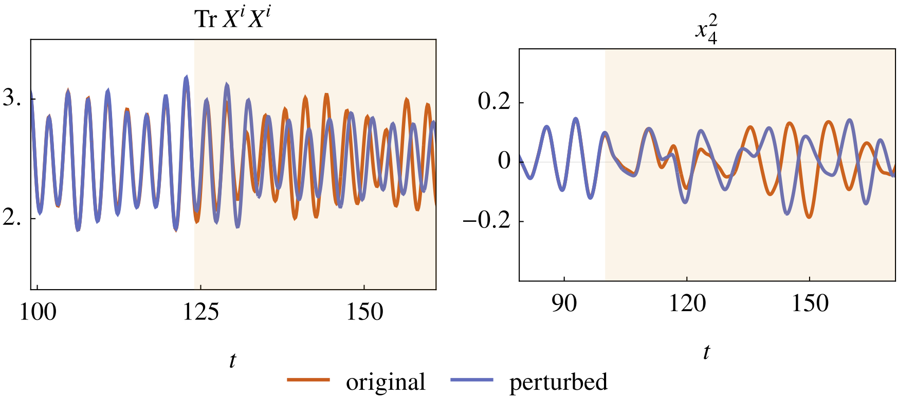

# BFSS Matrix Model Simulations

> **Note:** This codebase accompanies the Master's Thesis: **"Black Holes through the lens of Matrix Theory"**, submitted to the Department of Physics, **IIT Madras** (2023).

## 🔭 Overview


*Figure: Representative output from the analysis suite illustrating chaotic dynamics in the BFSS Matrix model.*

This repository contains the high-performance C++ simulation framework and Mathematica analysis notebooks used to study the classical dynamics of the **BFSS (Banks-Fischler-Shenker-Susskind) Matrix Model**.

The project investigates the holographic duality between strongly coupled gauge theories and gravitational physics. specifically focusing on the **bosonic sector** of the BFSS model at high energies (weak coupling). Key results derived from this code include the demonstration of classical chaos, the "memorylessness" of microstates, and the emergence of **Random Matrix Theory (GUE)** behavior in long-time dynamics.

### Key Physics Goals

* **Holography:** Probing the microscopic dynamics of black hole horizons via matrix mechanics.
* **Chaos:** Quantifying sensitivity to initial conditions (Lyapunov exponents) in matrix geometries.
* **Thermalization:** Studying how deterministic matrix evolution mimics thermodynamic black hole microstates.

## 🚀 Features

* **Symplectic Integration:** Implements the **McLachlan symmetric B3A stepper (6th order RKN)** for high-precision, energy-conserving evolution of Hamiltonian systems.
* **Template Metaprogramming:** Heavily templated C++20 architecture allowing compile-time optimization for arbitrary matrix size  and number of matrices .
* **SU(N) Structure:** Handles  structure constants and generators for accurate gauge theory simulations.
* **Analysis Suite:** Comprehensive Mathematica notebooks for computing:
* Eigenvalue distributions (Level repulsion).
* Moment statistics (Skewness, Kurtosis).
* Comparisons with Gaussian Unitary Ensembles (GUE).


## 🛠️ Installation & Dependencies

### Prerequisites

* **C++ Compiler:** GCC (`g++`) supporting **C++20**.
* **Boost Libraries:** Specifically `boost::numeric::odeint` and `boost::multi_array`.
* **Mathematica:** (Optional) For running analysis notebooks in `mathematica/`.

### Building the Project

The project uses a standard `Makefile`.

1. **Clone the repository:**
```bash
git clone https://github.com/rshrj/matrix-models-cpp.git
cd matrix-models-cpp
```


2. **Compile the library and objects:**
```bash
make
```


3. **Compile specific executables:**
To build the state generators or simulation runners:
```bash
make GenStates.prog   # Generates initial random states
make TrialRun.prog    # Runs the time evolution
```


*Executables will be placed in the `bin/` directory.*

## 💻 Usage

The workflow generally involves three steps: Generating an initial state, perturbing it (if studying chaos), and running the time evolution.

### 1. Generate Initial Conditions

Generate a random matrix configuration with normalized energy  satisfying the Gauss constraint.

```bash
./bin/GenStates
```

*Output: Saves a `.dat` file in `runs/States/`.*

### 2. Time Evolution

Run the symplectic integrator on a generated state.

```bash
./bin/TrialRun <filename.dat>
```

*Output: Generates time-series data of matrix elements and momenta.*

### 3. Analysis

Use the notebooks in `mathematica/notebooks/` to process the output data. Key notebooks include:

* `genStats.wls`: Generates statistical moments of the matrix elements.
* `gue-potential.nb`: Compares simulation data against Random Matrix Theory predictions.


## 📂 Directory Structure

```text
.
├── docs/               # LaTeX templates and documentation
├── external/F/         # Pre-computed SU(N) structure constants
├── include/matrices/   # Core C++ header files (Template logic)
│   ├── Matrices.hpp       # Matrix algebra definitions
│   └── MatrixType.hpp     # Boost operator overloads
├── mathematica/        # Analysis suite
│   ├── notebooks/         # .nb files for plotting and theory comparison
│   └── scripts/           # .wls scripts for batch processing
├── src/                # Source code
│   ├── GenStates.cpp      # Initial condition generator
│   ├── GenPert.cpp        # Perturbation generator (for Chaos study)
│   └── TrialRun.cpp       # Main simulation runner (Symplectic Integrator)
├── Makefile            # Build configuration
└── README.md           # This file
```

## 📐 Numerical Methods

The core of the simulation relies on solving the BFSS equations of motion:
$$\ddot{X}^i = -[[X^i, X^j], X^j]$$

We treat this as a Hamiltonian system. To ensure long-time stability and energy conservation—crucial for studying ergodic properties—we strictly use **Geometric Integrators**.

* **Method:** Runge-Kutta-Nyström (RKN).
* **Stepper:** Symplectic McLachlan B3A (6th order).
* **Implementation:** `boost::numeric::odeint`.

## 🎓 Thesis Citation

If you use this code or the results in your research, please cite the underlying thesis:

```bibtex
@mastersthesis{Raj2023BFSS,
  author       = {Rishi Raj},
  title        = {Black Holes through the lens of Matrix theory},
  school       = {Indian Institute of Technology Madras},
  year         = {2023},
  month        = {May},
  type         = {Bachelor of Science (Hons) and Master of Science Dual Degree},
  supervisor   = {Dr. Ayan Mukhopadhyay},
  note         = {Co-supervisor: Dr. Vishnu Jejjala}
}
```

## 📜 License

This project is licensed under the MIT License. See the [LICENSE](LICENSE) file for details.


## 🙏 Acknowledgements

* **Dr. Ayan Mukhopadhyay** (IIT Madras) for supervision and mentorship.
* **Dr. Vishnu Jejjala** (University of the Witwatersrand) for co-supervision and insights.
* **Shivaprasad Hulyal** and **Tanay Kibe** for discussions and simulation support.
* Computations were performed on the **IITM 'Aqua' and 'Quantum' HPC Clusters**.

---

*Author: Rishi Raj | 2023*